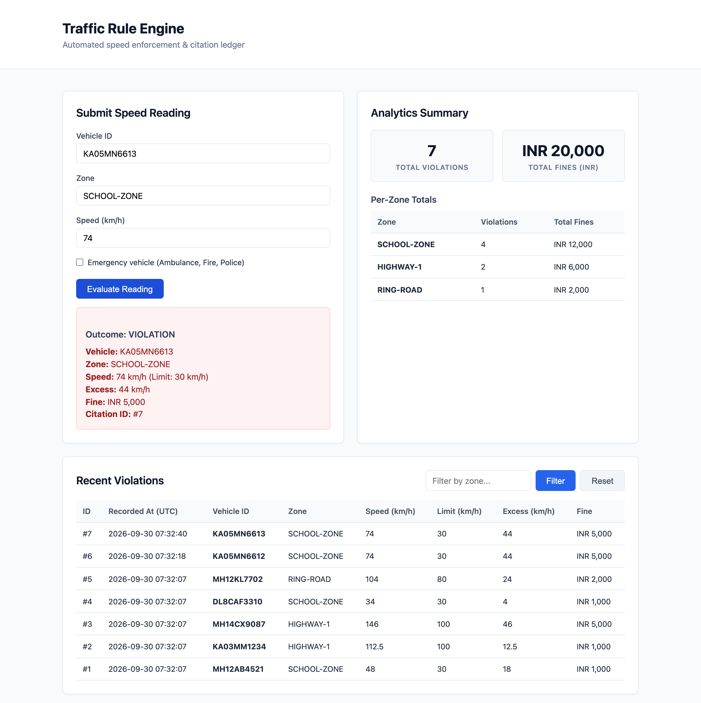

# Traffic Engine

[](https://github.com/Krish3101/trafficengine/actions/workflows/tests.yml)

Takes a vehicle speed reading, decides whether it's a violation, and works out the fine.
Spring Boot 3 on Java 21 with PostgreSQL, and a small dashboard for submitting readings and
seeing what came of them.

**Live demo:** <https://traffic-app-oxw2.onrender.com> (free hosting, so the first load can
take about a minute while it wakes up).

Three outcomes:

- `WITHIN_LIMIT` — at or under the zone's limit, nothing recorded
- `EXEMPT` — over the limit but flagged as an emergency vehicle, nothing recorded
- `VIOLATION` — over the limit, citation recorded with a fine based on how far over



## The rules are configuration, not code

Penalty policy changes more often than the software that applies it. So everything that
decides an outcome lives in `src/main/resources/application.yml`, and changing a limit or
a fine doesn't mean touching Java:

```yaml
traffic:
  rules:
    currency: INR
    default-speed-limit-kph: 80.0
    zone-speed-limits:
      SCHOOL-ZONE: 30.0
      HIGHWAY-1: 100.0
    default-fine: 1000
    fine-tiers:
      - over-by-kph: 40.0
        amount: 5000
      - over-by-kph: 20.0
        amount: 2000
      - over-by-kph: 0.0
        amount: 1000
```

Two decisions in there are worth knowing about.

Tiers are sorted by threshold, highest first, and the excess (`speed - limit`) takes the
first one it is strictly above — so the order you write them in the file doesn't matter.
The boundary is exclusive: an excess of exactly 20.0 does not reach the 20.0 tier, it falls
to the one below. If it is above none of them, `default-fine` applies.

Zone names match case-insensitively, and a zone that isn't listed falls back to
`default-speed-limit-kph` rather than being rejected — an unknown camera location
shouldn't mean no enforcement.

## Where the deciding happens

```text
src/main/java/org/krish/traffic/
  RulesConfig  hands the rule engine and its settings to Spring
  rules/       SpeedRuleEngine and its records — no Spring, no database
  violation/   JPA entity, repository, service ledger
  web/         controllers, DTOs, exception handling
src/main/resources/
  application.yml    the rules above
  static/            dashboard
```

`rules/` is the whole point of the layout. It has no dependency on Spring or on the
database, so the tier boundaries and the exempt path are tested directly against the
engine with no application context to start.

## Sending a reading

```bash
curl -X POST http://localhost:8080/api/readings \
  -H "Content-Type: application/json" \
  -d '{"vehicleId":"KA03MM1234","zone":"SCHOOL-ZONE","speedKph":55.0,"emergency":false}'
```

Returns `201` when a citation was recorded, `200` when the reading was within limit or
exempt, and `400` with the offending fields when the input is invalid.

`GET /api/violations` lists recent citations, optionally filtered by `zone` and `limit`
(default 50, max 200). `GET /api/analytics/summary` returns totals and a per-zone breakdown.

## Running it

Needs Java 21 or newer and Docker. The Maven wrapper handles the rest.

```bash
./scripts/start.sh     # starts PostgreSQL in Docker, then the app on http://localhost:8080
./mvnw test
./scripts/reset.sh     # delete the database and target/ (stop the app first)
```

PostgreSQL runs from `docker-compose.yml` on port 5433, so it won't clash with one you
already have on 5432. On a server, point the app at a database with `DB_HOST`, `DB_PORT`,
`DB_NAME`, `DB_USER` and `DB_PASSWORD`; the `Dockerfile` builds the image for that.

The API tests run through MockMvc and check status codes, validation errors and the
analytics totals. They use an in-memory H2 database so they run without Docker, which means
they don't catch anything PostgreSQL does differently.

## What it doesn't do

Tables are created by Hibernate on startup (`ddl-auto: update`) rather than by versioned
migrations, which is fine for one table and wouldn't be past a few. There's no
authentication, so anyone who can reach the port can submit a reading. Fine tiers are flat
amounts rather than anything that varies by vehicle class or repeat offence.

## License

[MIT](LICENSE)
